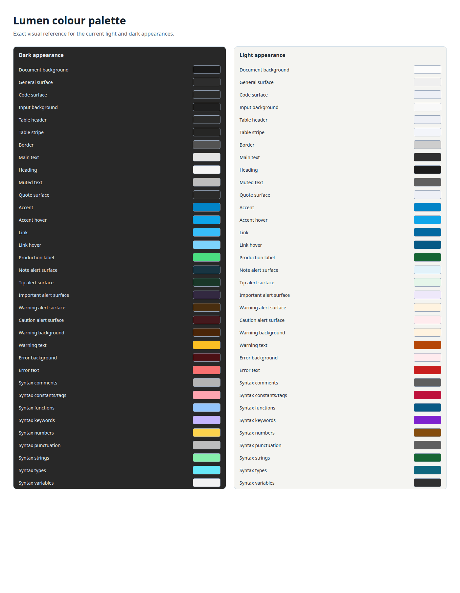

# Lumen colour palette reference

This fixture is the canonical visual reference for Lumen's current colour tokens. Update this document and its swatch image whenever a palette token changes.

## Surface and text tokens

| Token               | Dark appearance | Light appearance | Used for                                             |
| ------------------- | --------------- | ---------------- | ---------------------------------------------------- |
| Document background | `#1a1a1a`       | `#fcfcfc`        | Window and document canvas                           |
| General surface     | `#2d2d2d`       | `#efefef`        | Status bar, Find panel, buttons, and neutral notices |
| Code surface        | `#2b2b2a`       | `#eef0f6`        | Inline code and fenced code blocks                   |
| Input background    | `#202020`       | `#f8f8f8`        | Find input and unchecked task boxes                  |
| Table header        | `#2b2b2a`       | `#eef0f6`        | Table headers                                        |
| Table stripe        | `#262625`       | `#f3f5fa`        | Even table rows                                      |
| Border              | `#535353`       | `#cdcdcd`        | Controls, tables, separators, heading rules          |
| Main text           | `#e4e4e4`       | `#303030`        | Document prose                                       |
| Heading             | `#f5f5f5`       | `#1c1c1c`        | Headings and table headers                           |
| Muted text          | `#bdbdbd`       | `#5f5f5f`        | Blockquotes, status bar, Find status                 |
| Quote surface       | `#2b2b2a`       | `#eef0f6`        | Blockquote background                                |

## Semantic and interactive tokens

| Token              | Dark appearance | Light appearance | Used for                                                         |
| ------------------ | --------------- | ---------------- | ---------------------------------------------------------------- |
| Accent             | `#0284c7`       | `#0284c7`        | Focus borders, checked tasks, blockquote rule, development label |
| Accent hover       | `#0ea5e9`       | `#0ea5e9`        | Accent interaction state                                         |
| Link               | `#38bdf8`       | `#0369a1`        | Markdown links                                                   |
| Link hover         | `#7dd3fc`       | `#075985`        | Hovered Markdown links                                           |
| Production label   | `#4ade80`       | `#166534`        | Production-build label                                           |
| Note alert surface | `#183542`       | `#e2f2fa`        | Informational Markdown alert                                     |
| Tip alert surface  | `#193728`       | `#e5f6ea`        | Advisory Markdown alert                                          |
| Important surface  | `#332941`       | `#eee8fa`        | Important Markdown alert                                         |
| Warning alert      | `#492e0f`       | `#fff3e0`        | Warning Markdown alert                                           |
| Caution alert      | `#45191d`       | `#ffebee`        | Caution Markdown alert                                           |
| Warning background | `#4a2508`       | `#fff3e0`        | Recoverable warning banner                                       |
| Warning text       | `#fbbf24`       | `#b54708`        | Warning title and message                                        |
| Error background   | `#4c1014`       | `#ffebee`        | Recoverable and blocking error states                            |
| Error text         | `#f87171`       | `#c81e1e`        | Error title and message                                          |

## Syntax tokens

| Token              | Dark appearance | Light appearance | Used for                            |
| ------------------ | --------------- | ---------------- | ----------------------------------- |
| Comments           | `#b3b3b3`       | `#5f5f5f`        | Comments and documentation          |
| Constants and tags | `#fda4af`       | `#be123c`        | Constants, attributes, tags, labels |
| Functions          | `#93c5fd`       | `#075985`        | Functions, methods, properties      |
| Keywords           | `#c4b5fd`       | `#7e22ce`        | Keywords, operators, CSS directives |
| Numbers            | `#fcd34d`       | `#854d0e`        | Numeric literals                    |
| Punctuation        | `#bdbdbd`       | `#5f5f5f`        | Brackets, delimiters, escapes       |
| Strings            | `#86efac`       | `#166534`        | Strings                             |
| Types              | `#67e8f9`       | `#0f677f`        | Types                               |
| Variables          | `#f2f2f2`       | `#303030`        | Variables and parameters            |
